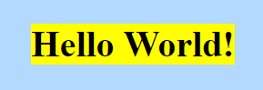
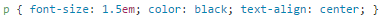

# GitHub-Pages 2.0

Wir haben unsere ursprüngliche Website upgedatet, um euch vom lästigen Scrollen zu befreien!

https://murielantonia.github.io/GitHub-Pages-2.0/Startseite

LG, Muriel und Antonia!

[Achtzehnte Informatikstunde](#achtzehn)
[Neunzehnte Informatikstunde](#neunzehn)
[Zwanzigste Informatikstunde](#zwanzig)

#Achtzehnte Informatikstunde <a name="achtzehn"><a/>                                                              23.02.2017

Die Text- und Grafikinhalte unserer Tic-Tac-Toe Galaxy haben wir bei unserem letzten Projekt strukturiert und damit das Grundgerüst für eine Webseite erstellt (HTML). Da diese optisch wenig ansprechend ist, konzentrieren wir uns in diesem letzten Schulhalbjahr auf das Aneignen von CSS (Cascading Style Sheets) und damit auf die Formatierung der Überschriften, Paragraphen und Bilder. 
Zunächst erstellten wir eine neue Datei formate.css in diesem Repository (GitHub Pages 2.0).

")

Um nun mit Css zu arbeiten, nutzen wir folgendes Tutorial:

https://www.w3schools.com/css/default.asp

#Neunzehnte Informatikstunde <a name="neunzehn"><a/>                                                                  01.03.2017

#Zwanzigste Informatikstunde<a name="zwanzig"><a/>                                                                   02.03.2017

