<h1>GitHub-Pages 2.0</h1>

Wir haben unsere ursprüngliche Website upgedatet, um euch vom lästigen Scrollen zu befreien!

https://murielantonia.github.io/GitHub-Pages-2.0/Startseite

LG, Muriel und Antonia!

<h2>Inhaltsverzeichnis</h2>

[Achtzehnte Informatikstunde](#achtzehn)

[Neunzehnte Informatikstunde](#neunzehn)

[Zwanzigste Informatikstunde](#zwanzig)

[Einundzwanzigste Informatikstunde](#einundzwanzig)

[Zweiundzwanzigste Informatikstunde](#zweiundzwanzig)

[Zusätzliche Informatikstunde](#zusatz)

[Dreiundzwanzigste Informatikstunde](#dreiundzwanzig)

[Vierundzwanzigste Informatikatunde](#vierundzwanzig)

<h2>Achtzehnte Informatikstunde 23.02.2017</h2><a name="achtzehn"><a/>                                                      

Die Text- und Grafikinhalte unserer Tic-Tac-Toe Galaxy haben wir bei unserem letzten Projekt strukturiert und damit das Grundgerüst für eine Webseite erstellt (HTML). Da diese optisch wenig ansprechend ist, konzentrieren wir uns in diesem letzten Schulhalbjahr auf das Aneignen von CSS (Cascading Style Sheets) und damit auf die Formatierung der Überschriften, Paragraphen und Bilder. 
Zunächst erstellten wir eine neue Datei formate.css in diesem Repository (GitHub Pages 2.0). Um nun erste, allgemeingültige Änderungen vornehmen zu können, mussten wir jedes HTML-Dokument mit dem externen Stylesheet formate.css, den wir soeben erstellt haben, pfadmäßig verlinken. Diese Einbindung geschieht durch einen Link, der im Head der HTML-Dokumente definiert wird. In diesen externen Stylesheet können wir den Look der gesamten Website, also auch für alle "Unterseiten" verändern, indem wir nur auf ein einziges Dokument zugreifen. Beispielsweise haben wir zunächst die Schriftgröße auf Start- und Subseiten verändert, um erstmalig von diesem Prinzip Gebrauch zu machen. 

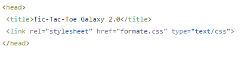

Übersetzung: Mit dem Attribut rel wird die Beziehung von dem Element "head" und der verlinkten Datei angegeben. Der Name ist Programm. "stylesheet" bedeutet, dass ein Stylesheet eingebunden werden soll. Das Attribut href referenziert die einzubindende Stylesheet-Datei. Der Medientyp der formate.css Datei wird mit dem Attribut type definiert, es handelt sich um eine CSS-Textdatei.

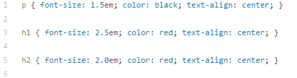

Übersetzung: Auf diesem Bild sieht man einige Eigenschaften, Schriftbild und Textformatierung, die wir den Elementen p, h1 und h2 zugeschrieben haben. Nach diesen Veränderungen sehen die dazugehörigen Elemente unserer Website so aus.

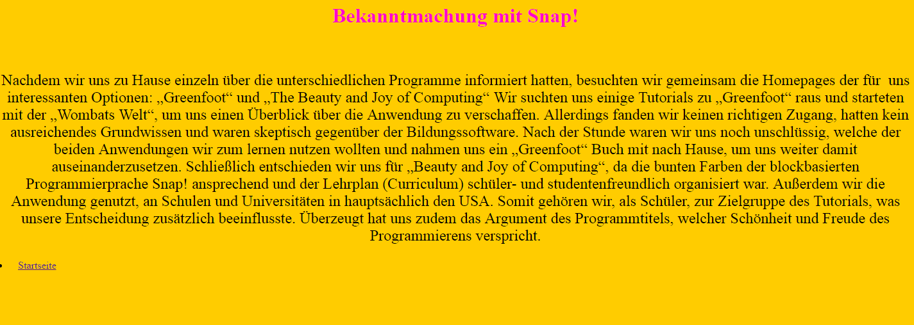

")

Geheimtipp: Dieses Online-Tutorial enthält viele wichtige und relevante Informationen, die uns die Erarbeitung von HTML und CSS erleichtert haben. https://www.w3schools.com/css/default.asp

<h2>Neunzehnte Informatikstunde</h2><a name="neunzehn"><a/>                                                       <h2>01.03.2017</h2>

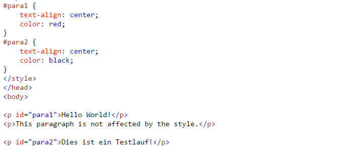

*Arten von Stylesheets beschreiben (external, internal, inline)

<h2>Zwanzigste Informatikstunde</h2><a name="zwanzig"><a/>                                                        <h2>02.03.2017</h2>

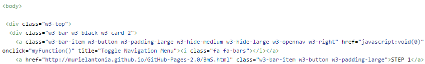

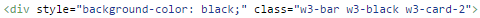

*Quellcode Nav.leiste beschreiben!!

<h2>Einundzwanzigste Informatikstunde</h2><a name="einundzwanzig"><a/>                                                           08.03.2017

Heute überarbeiteten wir unsere bereits erstellte Navigationsleiste. Wir nutzten zuvor den Code von dem Tutorial, jetzt haben wir nocheinmal einen eigenen geschrieben.

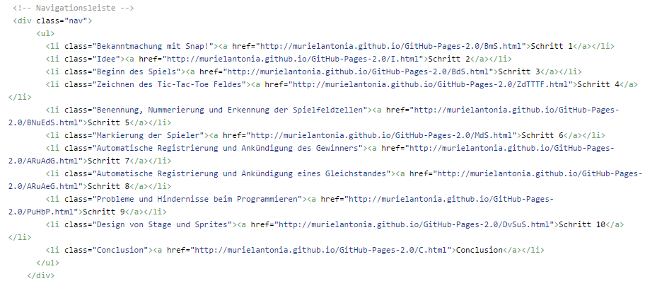

Diesen Code fügten wir nun bei jeder unserer Seiten ein. So kann man von jeder Unterseite zu jeder anderen Unterseite, sowie der Startseite zurückkehren.

<h2>Zweiundzwanzigste Informatikstunde</h2><a name="zweiundzwanzig"><a/>                                    <h2>09.03.2017</h2>

Um einen Blocktext zu erstellen, ersetzten wir das für die Paragraphen (p) zuvor genutzte "center" durch "justify". Außerdem sollte die Schriftfarbe der Paragraphen nun weiß statt schwarz sein, um sich von dem Hintergrund besser abzuheben.

Übersetzung:

Um auch die Schriftart zu verändern, muss eine neue class "sens-serif" hinzugefügt werden. Diese class wird dann in die einzelnen Dokumente der Unterseiten ebenfalls hinzugefügt.

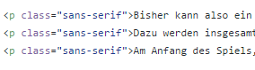

Übersetzung:

Die Website mit Blocktext, einer neuer Schriftart ohne Serifen und weißer Schriftfarbe sieht nun wie folgt aus:

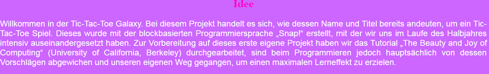

Nachdem wir diese Schritte gemeistert hatten, veränderten wir die Seitenränder von 500 zu 200, fügten auf jede Unterseite den Galaxy-Hindergrund ein und veränderten auch die Schriftart der Titel. Außerdem fügten wir unserer Navigationsleiste einen "Startseite" Tab hinzu. Wir arbeiten nun weiter daran, unsere Website noch weiter zu perfektionieren.

Wir wollen unsere Navigationsleiste horizontal formatieren und die Farbe ändern.
Dies schafften wir sogar noch in dieser Stunde mit folgendem Code:

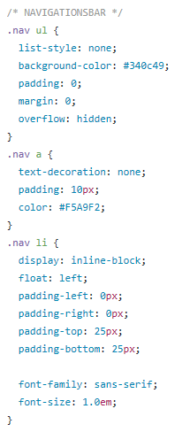

Übersetzung:

Wir veränderten auch die Hintergrundfarbe der Navigationsleiste

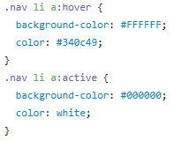

Die Navigationsleiste sieht nun wie folgt aus:

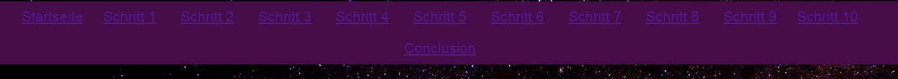

Nun soll noch die Schriftart, sowie die Schriftfarbe in der Navigationsleiste verändert werden. Außerdem soll der Block, welcher die Maus berührt farbig unterlegt werden.

<h2>Zusätzliche Informatikstunde</h2>                                                   <h2>10.03.2017</h2>

Wir setzten uns weiter mit der Navigationsleiste auseinander und konnte die Ziele einer neuen Schriftart, Schriftfarbe und bei Berührung neue Farbe erfüllen.

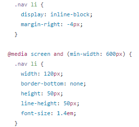

Übersetzung:

Die Navigationsleiste sieht nun wie folgt aus:

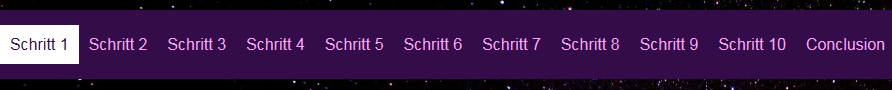

Um unserer Website mehr Shcwung zu geben wollten wir gerne eine Animation einbinden. Wir suchten uns ein animiertes Bild heraus ( http://www.123gif.de/sternschnuppen/gif-planeten-0328.gif.html ) und setzten dies auf unsere Startseite. 

Dazu musste folgender Code an die Stelle im Quellcode geschrieben werden, wo das Bild später erscheinen soll.

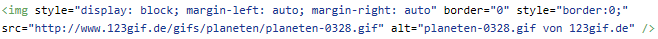

Übersetzung:

Unsere Startseite gefällt uns nun schon sehr gut. Wir haben schon einige Hindernisse überwunden und sind gut dabei, die Website zu perfektionieren. Die Navigationsleiste konnten wir erfolgreich horizontal einrichten und Hintergrundfarbe, Schriftfarbe udn Schriftart verändern. Außerdem verändert sich der jeweilige Tab, welcher angeklickt werden soll. Wir wollen nun noch erreichen, dass die navigationsleiste beim scrollen fixiert bleibt. So muss man als Leser nicht wieder zum Anfang scrollen, um zu einer der anderen Unterseiten zu gelangen.
Auch das Layout mit dem einheitlichen Galaxy-Hintergrund auf allen Seiten gefällt uns bereits sehr gut! Wir überlegen noch eine weitere Leiste hinzuzufügen, in welcher unsere "Werbung" mit dem Link zu unserem GitHub Account steht, zu erstellen. Der einheitliche Blocktext und die Schriftfarbe aller Paragraphen gefällt uns ebenfalls schon sehr gut. Wir sind außerdem sehr glücklich darüber, ein animiertes Bild auf der Startseite eingefügt zu haben. So fällt dem Leser die Startseite direkt auf und bleibt in Erinnerung. Ein weiterer Höhepunkt wäre es, einen Startsound beim Öffnen unserer Website zu erstellen! 

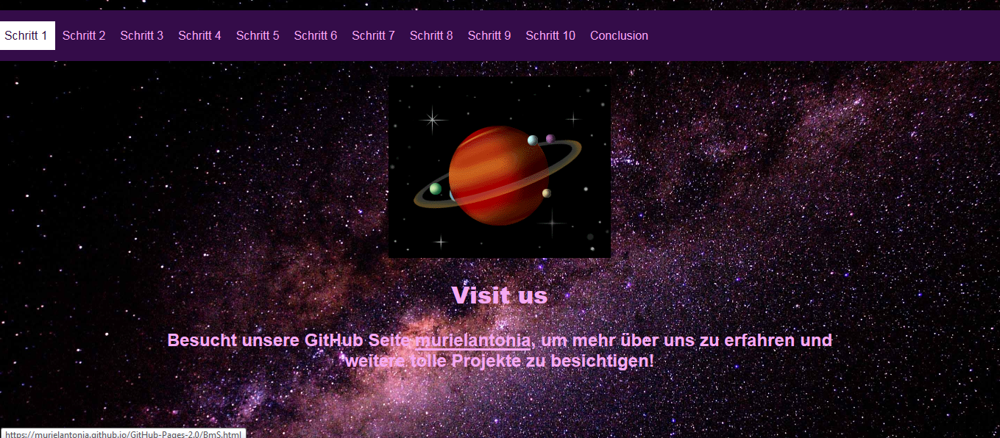

<h2>Dreiundzwanzigste Informatikstunde</h2>                                    <h2>14.03.2017</h2>

Heute ließen wir die Website von einer außenstehenden Person betrachten. Dabei wollten wir herausfinden, was noch wichtiges fehlt und uns (durch langes Betrachten und Arbeiten mit der Website) noch nicht aufgefallen ist. 
Wir wurden darauf hingewiesen, dass die einzelnen Unterseiten durch Schritt 1, Schritt 2, ... in der Navigationsleiste nicht genau genug beschrieben sind, wenn auf den jeweiligen Seiten keine Überschriften vorhanden sind. Wir wollen dies aber so lassen, weil eine ausführliche Beschreibung zu lang für die eine Leiste wäre. Ein weiteres Problem ist, dass im head der Website nicht alles zu lesen ist, weil die Überschriften zu lang sind. 
Dieser Fehler, dass die Unterseiten keine Überschriften haben, war ursprünglich kein Fehler!! Es existieren Überschriften, welche lediglich hinter der Navigationsleiste verborgen sind.
Unsere Website ist also vom Aussehen her ansprechend, wir haben nur ein Fehler im Code der Navigationsleiste gemacht.
Um diesen Fehler zu beheben, schrieben wir in die formate.css Datei für die h2 Überschriften einen Abstand zum obereren Rand (margin-top) von 2.5em. Außerdem fanden wir heraus, dass sich ein Abschnitt kopiert und falsch eingefügt hatte. Dies geschieht manchmal, wenn der Rechner zu langsam ist und so wild im Quellcode herumspringt, sobald man etwas anklickt...
Ein weiteres Problem stellte sich damit, dass die Read.me Datei die Überschriften, die mit "#" markiert sind, nicht mehr erkennt. So müssen wir alle Überschriften mit h1, h2 versehen. Dies ist ein zusätzlicher Arbeitsaufwand.

<h2>Vierundzwanzigste Informatikstunde</h2><a name="vierundzwanzig">                                  <h2>16.03.2017</h2>

