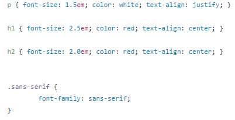

<h1>GitHub-Pages 2.0</h1>

Wir haben unsere ursprüngliche Website upgedatet, um euch vom lästigen Scrollen zu befreien!

https://murielantonia.github.io/GitHub-Pages-2.0/Startseite

LG, Muriel und Antonia!

<h2>Inhaltsverzeichnis</h2>

[Achtzehnte Informatikstunde](#achtzehn)

[Neunzehnte Informatikstunde](#neunzehn)

[Zwanzigste Informatikstunde](#zwanzig)

[Einundzwanzigste Informatikstunde](#einundzwanzig)

[Zweiundzwanzigste Informatikstunde](#zweiundzwanzig)

[Zusätzliche Informatikstunde](#zusatz)

[Dreiundzwanzigste Informatikstunde](#dreiundzwanzig)

[Vierundzwanzigste Informatikatunde](#vierundzwanzig)

[Fünfundzwanzigste Informatikstunde](#fünfundzwanzig)

<h2>Achtzehnte Informatikstunde am 23.02.2017</h2><a name="achtzehn"><a/>                                                      

Die Text- und Grafikinhalte unserer Tic-Tac-Toe Galaxy haben wir bei unserem letzten Projekt strukturiert und damit das Grundgerüst für eine Webseite erstellt (HTML). Da diese optisch wenig ansprechend ist, konzentrieren wir uns in diesem letzten Schulhalbjahr auf das Aneignen von CSS (Cascading Style Sheets) und damit auf die Formatierung der Überschriften, Paragraphen und Bilder. 
Zunächst erstellten wir eine neue Datei formate.css in diesem Repository (GitHub Pages 2.0). Um nun erste, allgemeingültige Änderungen vornehmen zu können, mussten wir jedes HTML-Dokument mit dem externen Stylesheet formate.css, den wir soeben erstellt haben, pfadmäßig verlinken. Diese Einbindung geschieht durch einen Link, der im Head der HTML-Dokumente definiert wird. In diesen externen Stylesheet können wir den Look der gesamten Website, also auch für alle "Unterseiten" verändern, indem wir nur auf ein einziges Dokument zugreifen. Beispielsweise haben wir zunächst die Schriftgröße auf Start- und Subseiten verändert, um erstmalig von diesem Prinzip Gebrauch zu machen. 

Übersetzung: Mit dem Attribut rel wird die Beziehung von dem Element "head" und der verlinkten Datei angegeben. Der Name ist Programm. "stylesheet" bedeutet, dass ein Stylesheet eingebunden werden soll. Das Attribut href referenziert die einzubindende Stylesheet-Datei. Der Medientyp der formate.css Datei wird mit dem Attribut type definiert, es handelt sich um eine CSS-Textdatei.

Übersetzung: Auf diesem Bild sieht man einige Eigenschaften, Schriftbild und Textformatierung, die wir den Elementen p, h1 und h2 zugeschrieben haben. Nach diesen Veränderungen sehen die dazugehörigen Elemente unserer Website so aus.

")

Geheimtipp: Dieses Online-Tutorial enthält viele wichtige und relevante Informationen, die uns die Erarbeitung von HTML und CSS erleichtert haben. https://www.w3schools.com/css/default.asp

<h2>Neunzehnte Informatikstunde am 01.03.2017</h2><a name="neunzehn"><a/>                                                       

CSS ist eine Stylesheet-Sprache, mit der man Gestaltungsanweisungen programmieren kann, die oft zusammen mit HTML eingesetzt werden. Dabei unterscheidet man drei Arten von Stylesheets. Mit Inline-Styles können Veränderungen direkt und individuell mit dem betreffenden Element in Verbindung gebracht werden. Das dazugehörige Attribut "style" wird im Start-tag des Elementes verankert, der ihm zugehörige Wert steht eingeschlossen in Anführungszeichen. Diese Art der Formatierung ist jedoch zeitaufwendig und fehleranfällig, vorallem bei nachgelagerten Optimierungen der Website.  Statt das Attribut "style" für jedes Element neu definieren zu müssen, kann man alle diesbezüglichen Änderungen in einem Element "style" vornehmen und festhalten. Dieser "Eingebettete Stylesheet" steht immer im Kopfbereich eines Dokumentes und muss vom Browser für jedes Webdokument neu geladen werden. Auf dem Bildschirm ist nicht dessen Inhalt, sondern dessen Effekt zu sehen. Die dritte, und effizienteste, Strategie der Formatierung ist die Verwendung von "Externen Stylesheets", wie unsere formate.css Datei. Diese Art von Stylesheet fasst alle CSS-Deklarationen in sich zusammen und wird mit jedem HTML-Dokument verlinkt. Alle Dokumente, die auf das selbe Stylesheet zurückgreifen, müssen dieses nicht mehrmals herunterladen, sondern können auf die im Cache des Browsers gespeicherte Version zurückgreifen. Die Verwendung von Externen Stylesheets zuegt von Wartungsfreundlichkeit, Geschwindigkeit und Effizienz.  

Übersetzung: Auf diesem Bild ist eine beispielhafte Anwendung eines "Eingebetteten Stylesheet" zu erkennen. Im Kopfbereich des Dokumentes sind, für verschiedene Arten von Elementen, Schriftart und -größe definiert. Sobald das Element im Dokument auftritt, muss es mit einer Identität (ID) als solches belegt und damit mit dem Stylesheet verknüpft werden. Die Textformatierungen finden Verwirklichung und sind auf dem Computerbildschirm sichtbar.

<h2>Zwanzigste Informatikstunde am 02.03.2017</h2><a name="zwanzig"><a/>                                                        

Das Besondere an eines Klassen-Selektors ist, dass er auf mehreren Unterseiten verwendet werden kann und jeweils verlinkt ist zu der CSS-Datei, so können sich wiederholende Elemente definiert werden. Eine ID hingegen kann nur für ein Element verwendet werden. (Beispiel: Kapitel "Neunzehnte Informatikstunde)
Wichtig: Die Namen dürfen keine Sonderzeichen, Umlaute, Leerzeichen enthalten. Groß- und Kleinschreibung spielen keine Rolle ("case sensitiv").

<h2>Einundzwanzigste Informatikstunde am 08.03.2017</h2><a name="einundzwanzig"><a/>                                     

Heute überarbeiteten wir unsere bereits erstellte Navigationsleiste. Wir nutzten zuvor den Code von dem Tutorial, jetzt haben wir nocheinmal einen eigenen geschrieben.

Übersetzung: "div" definiert einen Teil im html-Dokument. Der Tag wird genutzt, um Blockelemente mit CSS zu formatieren. In diesem Fall geht es um den Klassen-Sektor der Navigationsleiste (nav). "ul" (unordered list) beschreibt die folgende Aufzählungsliste, welche ungeordnet sein darf. "li" beschreibt die verschiedenen Listen. In diesem Beispiel geht es um den Klassen-Sektor der Navigationsleiste. Dieser wird mit der jeweiligen Unterseite verlinkt (externer Link) und benannt. Das Attribut "href" bindet die Web-Adresse mit ein. Die Adressen sind immer der Link zu unserer GitHub Pages Seite mit der jeweiligen Benennung der Unterseite. 

Diesen Code fügten wir nun bei jeder unserer Seiten ein. So kann man von jeder Unterseite zu jeder anderen Unterseite, sowie der Startseite zurückkehren.

<h2>Zweiundzwanzigste Informatikstunde am 09.03.2017</h2><a name="zweiundzwanzig"><a/>                                    

Um einen Blocktext zu erstellen, ersetzten wir das für die Paragraphen (p) zuvor genutzte "center" durch "justify". Außerdem sollte die Schriftfarbe der Paragraphen nun weiß statt schwarz sein, um sich von dem Hintergrund besser abzuheben.

Übersetzung: Die in der css-Datei geschriebenen Befehle werden in allen Unterseiten mit html Code, welche mit der css-Seite verlinkt sind, automatisch übernommen und eingefügt.
Das "p" gilt also für alle Paragraphen. Die Schriftgröße ("font-size") beschreibt die Anpassung der Schrift. Hierfür gibt es vier Größeneinheiten (em, px, pt, %). Wir nutzten die Einheit "em", welche skalierbar ist. Sie entspricht der aktuellen Schriftgröße (1em=12pt=16px=100%)

Um auch die Schriftart zu verändern, mussten wir nun eine neue class "sens-serif" erstellen. Dazu wird ein neues Element im CSS-Dokument erstellt (".sans-serif").
Wichtig: Für Klassen muss in der CSS-Definition vor den Namen ein Punkt geschrieben werden.
Die Elemente können mit diesem Bezeichner angesprochen werden. Die HTML-Tags müssen dazu mit dem Attribut "class" versehen werden. Diese Klasse wird dann in die einzelnen Dokumente der Unterseiten ebenfalls hinzugefügt.

")

Wir nutzten den oben erstellten KLassen-Selektor (.sans-serif) für alle Paragraphen der Unterseiten. So ist nun auf unserer Website überall die gleiche Schriftart.

Die Website mit Blocktext, einer neuer Schriftart ohne Serifen und weißer Schriftfarbe sieht nun wie folgt aus:

Nachdem wir diese Schritte gemeistert hatten, veränderten wir die Seitenränder von 500 zu 200, fügten auf jede Unterseite den Galaxy-Hindergrund ein und veränderten auch die Schriftart der Titel. Außerdem fügten wir unserer Navigationsleiste einen "Startseite" Tab hinzu. Wir arbeiten nun weiter daran, unsere Website noch weiter zu perfektionieren.

Wir wollen unsere Navigationsleiste horizontal formatieren und die Farbe ändern.
Dies schafften wir sogar noch in dieser Stunde mit folgendem Code:

Übersetzung: Das Element "nav" umschließt Navigationsleisten und Menüs. In unserem externen Stylesheet definieren wir alle Formatierungen, die unsere Navigationsleiste betreffen. "ul" steht für "unordered list". In dieser Klasse konnten wir erste Eigenschaften der Leiste definieren, beispielsweise dessen Hintergrundfarbe. Der Außenabstand (margin) beschreibt die Entfernung eines Elementes zu einem Nachbarelement, der Innenabstand (padding) gibt den Abstand vom Rand zum Inhalt eines Elementes an. Da die klasse .nav ul jedoch nicht einzelne Elemente der Navigationsleiste, sondern die Liste der Titel und Links als Ganzes beschreibt, also als Überkategorie fungiert, lohnt es an dieser Stelle noch nicht, die Abstände innen und außen anzulegen. Die Liste hat voll keinen style, was bedeutet, dass sie keine Nummerierung oder Aufzählungszeichen enthält. Die Klassse .nav a beschreibt die Links zu den "Unterseiten" der Website, die an dieser Stelle in Form eines Buttons auftreten. Werden sie angeklickt, wird der Link abgerufen und man wird auf der Website navigiert. Hier ist ein Innenabstand integriert, damit der Link reagiert, wenn man den Text oder Rand anklickt. Der Text ist nicht "dekoriert", das heißt, er ist zu Designzwecken nicht als Link erkennbar gemacht, nicht unterstrichen, hinterlegt oder markiert. Die .nav li Klasse beschreibt die Listenelemente, in unserem Fall Schritt 1, Schritt 2, Schritt 3. Diese sollen nicht untereinander (vertikal), sondern nebeneinander (horizontal) angezeigt werden, wofür wir float: left definiert haben. Auch hier haben wir, aus ästhetischen Gründen, einen Innenabstand eingerichtet und damit die gesamte Leiste verbreitert. Auch Schriftart und -größe haben wir definiert. 

Wir veränderten auch die Hintergrundfarbe der Navigationsleiste, wenn der Cursor sich darüber bewegt (hover) oder sie anklickt (active).

Die Navigationsleiste sieht nun wie folgt aus:

Nun soll noch die Schriftart, sowie die Schriftfarbe in der Navigationsleiste verändert werden. Außerdem soll der Block farbig unterlegt werden, sobald der Cursor sich darüber bewegt.

<h2>Zusätzliche Informatikstunde am 10.03.2017</h2>                                                  

Wir setzten uns weiter mit der Navigationsleiste auseinander und konnte die Ziele einer neuen Schriftart, Schriftfarbe und Hintergrundfarbe umsetzen. Die Navigationsleiste sieht nun wie folgt aus:

Um unserer Website mehr Schwung zu geben, haben wir einen animierten Saturn eingefügt, der auf der Startseite erscheint. Wir suchten uns folgendes GIF heraus: ( http://www.123gif.de/sternschnuppen/gif-planeten-0328.gif.html ) 

Dazu musste folgender Code an die Stelle im Quellcode geschrieben werden, wo das Bild später erscheinen soll.

Übersetzung: Unsere Startseite gefällt uns nun schon sehr gut. Wir haben schon einige Hindernisse überwunden und sind gut dabei, die Website zu perfektionieren. Die Navigationsleiste konnten wir erfolgreich horizontal einrichten und Hintergrundfarbe, Schriftfarbe udn Schriftart verändern. Außerdem verändert sich der jeweilige Tab, welcher angeklickt werden soll. Auch das Layout mit dem einheitlichen Galaxy-Hintergrund auf allen Seiten gefällt uns bereits sehr gut! Wir überlegen noch eine weitere Leiste hinzuzufügen, in welcher unsere "Werbung" mit dem Link zu unserem GitHub Account steht, zu erstellen. Der einheitliche Blocktext und die Schriftfarbe aller Paragraphen gefällt uns ebenfalls schon sehr gut. Wir sind außerdem sehr glücklich darüber, ein animiertes Bild auf der Startseite eingefügt zu haben. So fällt dem Leser die Startseite direkt auf und bleibt in Erinnerung. Ein weiterer Höhepunkt wäre es, einen Startsound beim Öffnen unserer Website zu erstellen! 

<h2>Dreiundzwanzigste Informatikstunde am 14.03.2017</h2>                                

Heute ließen wir die Website von einer außenstehenden Person betrachten. Dabei wollten wir herausfinden, was noch wichtiges fehlt und uns, trotz langem Betrachten und Optimieren, nicht aufgefallen ist. 
Wir wurden darauf hingewiesen, dass die einzelnen Unterseiten durch Schritt 1, Schritt 2, ... in der Navigationsleiste nicht genau genug beschrieben sind, wenn auf den jeweiligen Seiten keine Überschriften vorhanden sind. Wir wollen dies aber so lassen, weil eine ausführliche Beschreibung zu lang für die eine Leiste wäre. Ein weiteres Problem ist, dass im head der Website nicht alles zu lesen ist, weil die Überschriften zu lang sind. 
Dieser Fehler, dass die Unterseiten keine Überschriften haben, war ursprünglich kein Fehler! Es existieren Überschriften, welche lediglich hinter der Navigationsleiste verborgen sind.
Unsere Website ist also vom Aussehen her ansprechend, wir haben nur ein Fehler im Code der Navigationsleiste gemacht.
Um diesen Fehler zu beheben, schrieben wir in die formate.css Datei für die h2 Überschriften einen Abstand zum obereren Rand (margin-top) von 2.5em. Außerdem fanden wir heraus, dass sich ein Abschnitt kopiert und falsch eingefügt hatte. Dies geschieht manchmal, wenn der Rechner zu langsam ist und so wild im Quellcode herumspringt, sobald man etwas anklickt.
Ein weiteres Problem stellte sich damit, dass die read.me Datei die Überschriften, die mit "#" markiert sind, nicht mehr erkennt. So müssen wir alle Überschriften mit h1, h2 versehen. Dies ist ein zusätzlicher Arbeitsaufwand.

<h2>Vierundzwanzigste Informatikstunde am 16.03.2017</h2><a name="vierundzwanzig">   

Die heutige Stunde haben wir damit angefangen, die Navigationsleiste auf der Startseite an die anderen Navigationsleisten anzugleichen. Das macht das Navigieren auf unserer Website einfacher. Außerdem haben wir, für mehr Übersichtlichkeit, die Überschriften fett formatiert.

Im Folgenden haben wir unsere Startseite und ehemalige Conclusion-Seite überarbeitet. Auf der Startseite steht nun etwas allgemeines über unser Projekt und die Conclusion. Aus der Conclusion-Seite wurde unsere Kontakt-Seite. Auf dieser steht eine Beschreibung unseres Teams und ein Link zu unserem GitHub-Account.

<h2>Fünfundzwanzigste Informatikstunde am 21.03.2017</h2><a name="fünfundzwanzig">

In unser letzten Informatikstunde vor der Abgabe unseres Projektes haben wir nocheinmal eine Checkliste mit den für uns wichtigsten Punkten einer Website gemacht:

-Ist der Kontrast von Text zum Hintergrund gut?

-Ist die Schriftgröße gut lesbar?

-Haben alle Links aussagekräftige Title-Tags?

-Werden Links leicht als Links erkannt? Unterstrichen?

-Ist die Hauptnavigation leicht auffindbar?

-Ist die Seitengeneration verständlich?

-Werden die wichtigsten Inhalte nach maximal zwei Klicks erreicht?

-Haben alle Seiten Überschriften?

-Sind alle Überschriften aussagekräftig und beinhalten das Schlüsselwort?

-Ziehen sich Styles und Farben einheitlich durch die Seite?

-Wird ein p Tag für Absätze benutzt?

-Sind die Seiten ansprechend gestaltet?

-Ist die Seitengeschwindigkeit in Ordnung?

-Ist (wenn vorhandene) Werbung nicht störend/lästig?

Nachdem wir alle dieser Punkte abhaken konnten, ist unsere Website fürs Erste fertig.
Es lässt sich noch vieles verbessern und perfektionieren, doch wir sind für diesen relativ kurzen Zeitraum zufrieden mit dem, was wir geschafft haben. Vergleicht man unsere GitHub-Pages mit der GitHub-Pages-2.0 erkennt man DEUTLICHE Unterschiede!
Wir freuen uns in der Zukunft weiter mit css zu arbeiten und weiter dazuzulernen.

Zum Abschluss vergleichen wir diese beiden Screenshots unsere Website OHNE und MIT Formatierungen und Stylesheets. 

